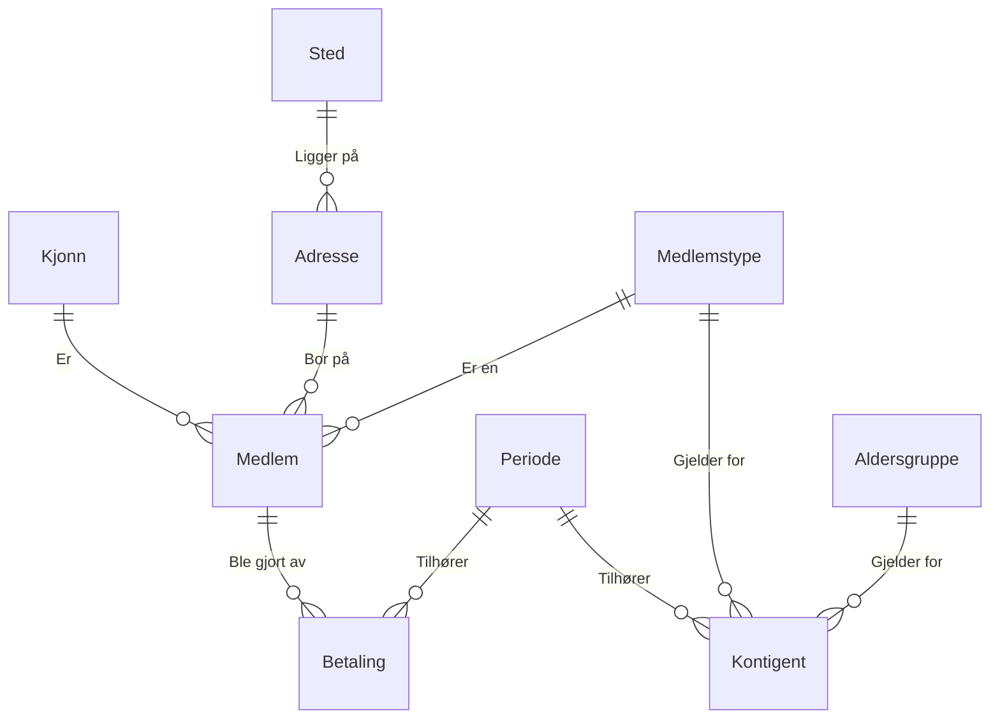

```sql
Poststed
    Postnummer          INT         NOT NULL    PRIMARY KEY
    Navn                TEXT        NOT NULL

Adresse
    Id                  INT         NOT NULL    PRIMARY KEY
    Gateadresse         TEXT        NOT NULL
    Postnummer          INT         NOT NULL    FOREIGN KEY (Poststed.Postnummer)

Periode
    Id                  INT         NOT NULL    PRIMARY KEY
    StartDato           TEXT        NOT NULL
    SluttDato           TEXT        NOT NULL

Medlemstype
    Id                  INT         NOT NULL    PRIMARY KEY
    Type                TEXT        NOT NULL    UNIQUE

Aldersgruppe
    Id                  INT         NOT NULL    PRIMARY KEY
    Gruppe              TEXT        NOT NULL    UNIQUE

Kjonn
    Id                  INT         NOT NULL    PRIMARY KEY
    Kjonn               TEXT        NOT NULL    UNIQUE

Kontigent
    Id                  INT         NOT NULL    PRIMARY KEY
    PeriodeId           INT         NOT NULL    FOREIGN KEY (Periode.Id)
    MedlemstypeId       INT         NOT NULL    FOREIGN KEY (Medlemstype.Id)
    AldersgruppeId      INT         NOT NULL    FOREIGN KEY (Aldersgruppe.Id)
    KontingentNOK       INT         NOT NULL

Medlem
    Id                  INT         NOT NULL    PRIMARY KEY
    Fornavn             TEXT        NOT NULL
    Etternavn           TEXT        NOT NULL
    Fodselsdato         TEXT        NOT NULL
    KjonnId             INT         NOT NULL    FOREIGN KEY (Kjonn.Id)
    MedlemstypeId       INT         NOT NULL    FOREIGN KEY (Medlemstype.Id)
    AdresseId           INT         NOT NULL    FOREIGN KEY (Adresse.Id)

Betaling
    Id                  INT         NOT NULL    PRIMARY KEY
    PeriodeId           INT         NOT NULL    FOREIGN KEY (Periode.Id)
    MedlemId            INT         NOT NULL    FOREIGN KEY (Medlem.Id)
    BelopNOK            INT         NOT NULL
    Innbetalt_dato      TEXT        NOT NULL
```