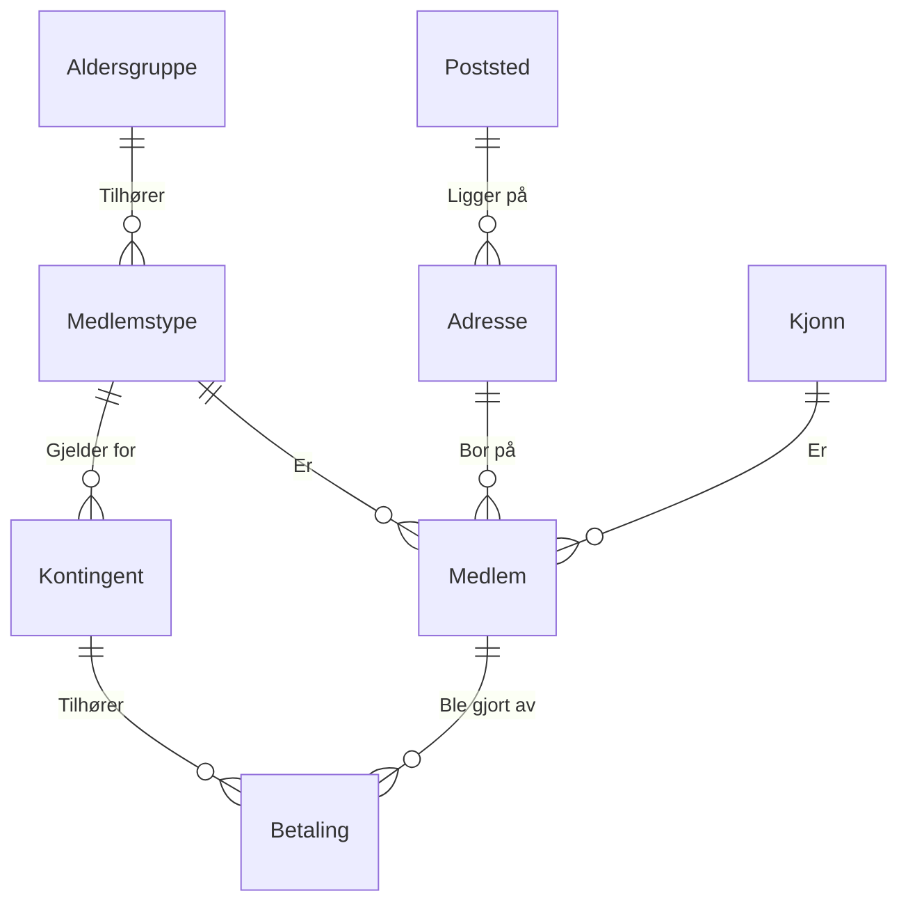

```sql
CREATE TABLE Poststed (
    Postnummer          TEXT        NOT NULL    PRIMARY KEY,
    Navn                TEXT
);


CREATE TABLE Adresse (
    Id                  INTEGER     NOT NULL    PRIMARY KEY,
    Postnummer          TEXT        NOT NULL,
    Gateadresse         TEXT        NOT NULL,
    FOREIGN KEY (Postnummer) REFERENCES Poststed(Postnummer)
);


CREATE TABLE Aldersgruppe (
    Id                  INTEGER     NOT NULL    PRIMARY KEY,
    Navn                TEXT        NOT NULL    UNIQUE
);


CREATE TABLE Medlemstype (
    Id                  INTEGER     NOT NULL    PRIMARY KEY,
    Navn                TEXT        NOT NULL,
    AldersgruppeId      INTEGER     NOT NULL,
    FOREIGN KEY (AldersgruppeId) REFERENCES Aldersgruppe(Id)
);


CREATE TABLE Kjonn (
    Id                  INTEGER     NOT NULL    PRIMARY KEY,
    Kjonn               TEXT        NOT NULL    UNIQUE
);


CREATE TABLE Kontingent (
    Id                  INTEGER     NOT NULL    PRIMARY KEY,
    MedlemstypeId       INTEGER     NOT NULL,
    Periode             INTEGER     NOT NULL,
    KontingentNOK       INTEGER     NOT NULL,
    FOREIGN KEY (MedlemstypeId) REFERENCES Medlemstype(Id)
);


CREATE TABLE Medlem (
    Id                  INTEGER     NOT NULL    PRIMARY KEY,
    Fornavn             TEXT        NOT NULL,
    Etternavn           TEXT        NOT NULL,
    Fodselsdato         TEXT        NOT NULL,
    KjonnId             INTEGER     NOT NULL,
    MedlemstypeId       INTEGER     NOT NULL,
    AdresseId           INTEGER     NOT NULL,
    FOREIGN KEY (KjonnId) REFERENCES Kjonn(Id),
    FOREIGN KEY (MedlemstypeId) REFERENCES Medlemstype(Id),
    FOREIGN KEY (AdresseId) REFERENCES Adresse(Id)
);


CREATE TABLE Betaling (
    Id                  INTEGER     NOT NULL    PRIMARY KEY,
    KontingentId         INTEGER     NOT NULL,
    MedlemsId           INTEGER     NOT NULL,
    BelopNOK            INTEGER     NOT NULL,
    InnbetaltDato      TEXT        NOT NULL,
    FOREIGN KEY (KontingentId) REFERENCES Kontingent(Id),
    FOREIGN KEY (MedlemsId) REFERENCES Medlem(Id)
);
```